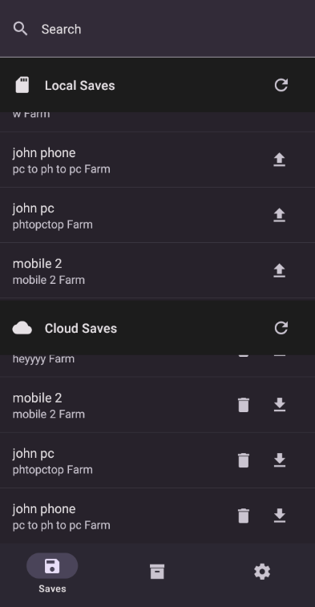
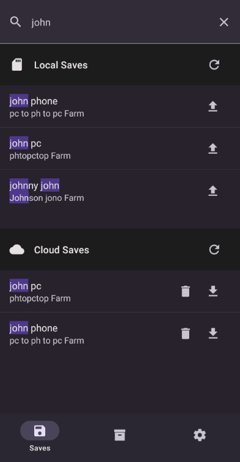
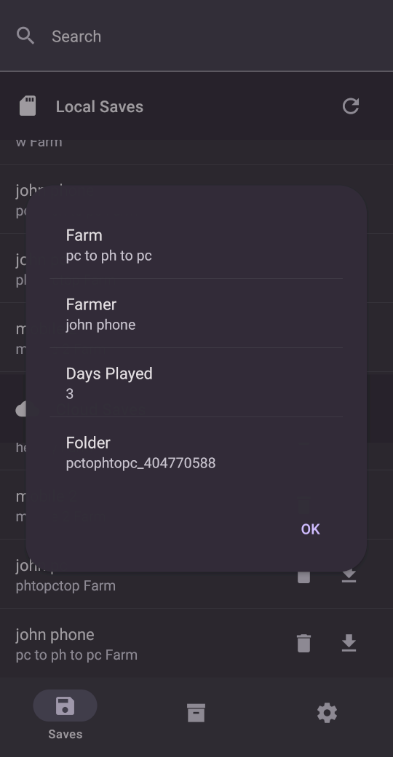
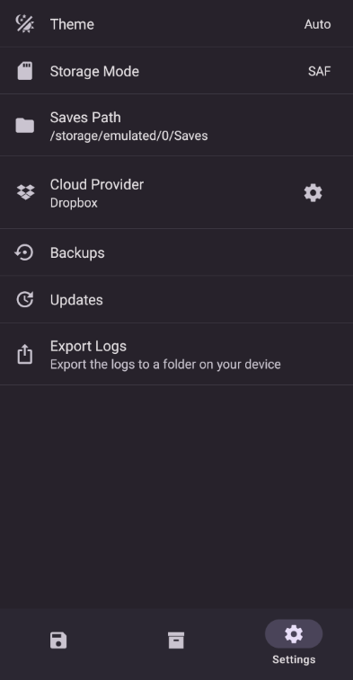
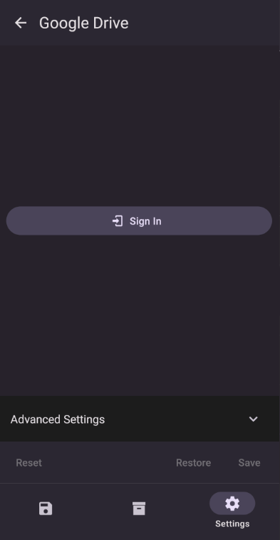

# CloudSync Mobile
CloudSync Mobile is an Android app that allows you to sync your Stardew Valley saves across multiple devices using cloud storage services like Dropbox, and Google Drive.

[SMAPI Mod](https://github.com/FawazTakahji/CloudSync)

## Installation
1. Make sure you have Android 7.0 or higher
2. Download the latest release from [Releases](https://github.com/FawazTakahji/CloudSync-Mobile/releases), check your device's architecture and download the correct one, if you are unsure you can download the universal apk

## Features
- Upload your saves to cloud storage services
- Download your saves from cloud storage services
- Backup your saves when uploading
- Get a warning if an existing save has more progress when uploading or downloading

## FAQ
### Which storage mode should I use?
You should always use the legacy mode if its available, its the fastest and most reliable, if you're unable to use it, shizuku mode is the second fastest, if you don't wan't to mess with shizuku, you should use SAF mode but it's the slowest and can't be used on Android 13 and above, if the selected saves path isn't a child of the Android folder the app will always use legacy mode.

## Todo
- Add support for other cloud storage services
- Add the ability to delete saves on the cloud from the cloud saves menu
- Add a screen to manage backups

## Screenshots
<details>
  <summary>Saves Screen</summary>

  
</details>
<details>
  <summary>Search</summary>

  
</details>
<details>
  <summary>Save Info</summary>

  
</details>
<details>
  <summary>Settings Screen</summary>

  
</details>
<details>
  <summary>Cloud Settings</summary>

  
</details>

## Building
Open a terminal in the project directory and install the project dependencies using the following command
```
npm install
```
after that run the expo prebuild command
```
npx expo prebuild
```

### Debugging
To debug the app start your emulator or connect your physical device with adb and run the following command
```
npx expo run:android
```

### Release
1. Create a keystore file in `/src/android/app`
2. Create a `gradle.properties` file in (`%userprofile%/.gradle` | `~/.gradle`) and add the following variables:
   ```
   CLOUDSYNC_UPLOAD_STORE_FILE=Your Keystore File Name
   CLOUDSYNC_UPLOAD_KEY_ALIAS=Your Keystore Alias
   CLOUDSYNC_UPLOAD_STORE_PASSWORD=Your Keystore Password
   CLOUDSYNC_UPLOAD_KEY_PASSWORD=Your Keystore Password
   ```
3. Open a teminal in `/src/android` and run the following command to build a bundle
   ```
   gradlew app:bundleRelease
   ```
   or this command to build apks for all architectures
   ```
   gradlew app:assembleRelease
   ```
4. The bundle will be in `src/android/app/build/outputs/bundle/release` and the apks will be in `src/android/app/build/outputs/apk/release`
5. If you're having problems with the path being too long, copy the project to the root of your drive and run the commands from there